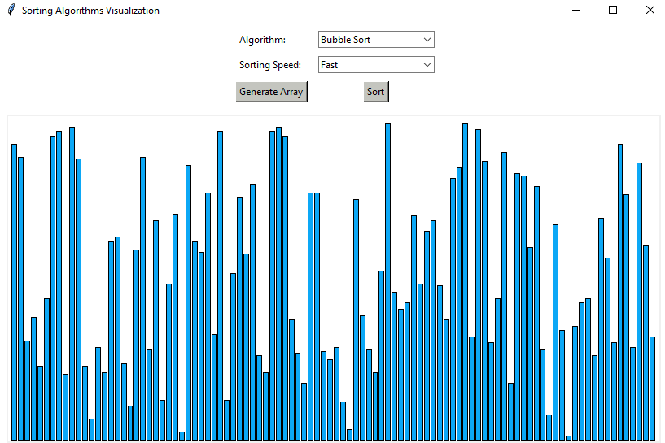

# Sorting Algorithms Visualizer
<p>Python application to visualize various sorting algorithms.</p>
<!-- <table>
  <tr>
    <td></td>
    <td></td>
    <td></td>
  </tr>
</table> -->
<p align='center'></p>

## Implemented Algorithms:
* Bubble Sort
* Insertion Sort
* Selection Sort
* Merge Sort
* Quick Sort
* Heap Sort
* Counting Sort

## Built With:
* Python 3.10.4
* Tkinter 8.6.12

<!-- ## Screenshots: -->
<!-- <p align="center"></p>
<p align="center"></p>
<p align="center"></p> -->

## Run It (Python >= 3.10):
- Clone the repository
```bash
$ git clone https://github.com/mandres2/sortingAlgorithm.git
```
- Run ```main.py``` from root
```bash
$ python3 main.py
```
