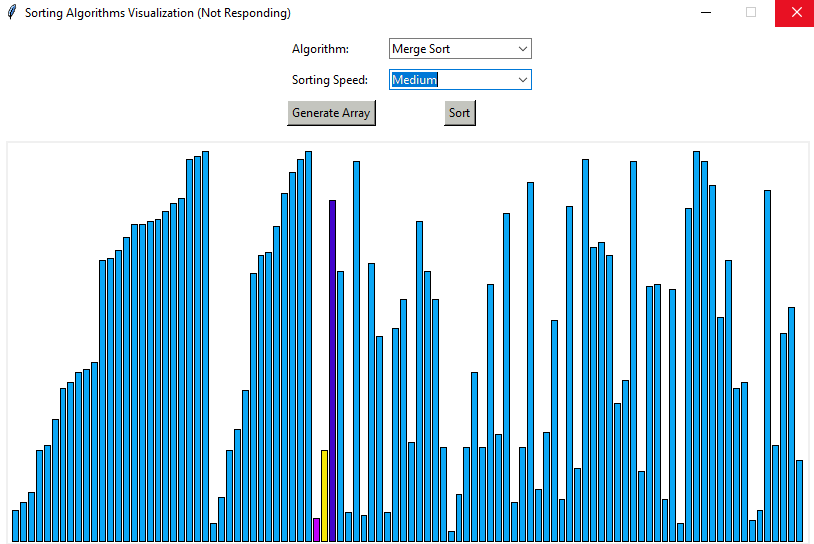
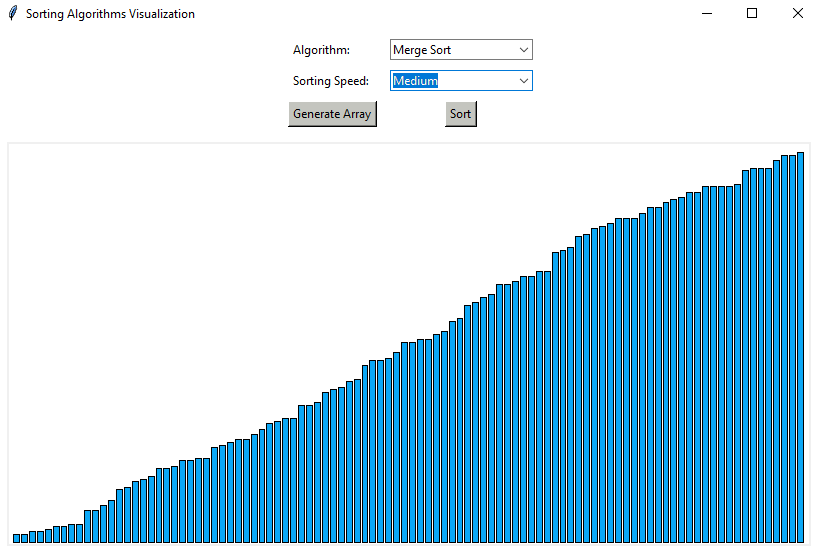

# Sorting Algorithms Visualizer

## Application Function: Implemented to visualize various sorting algorithms

<hr/>

### What is an Algorithm?

An algorithm is basically a process of set rules to be followed in calculations or other problem-solving operations. Algorithms define how a work is to be executed upon in order to get the expected result. In this application, it visualizes data being executed via 7 different types of algorithms:

1. Bubble Sort
2. Insertion Sort
3. Merge Sort
4. Quick Sort
5. Heap Sort
6. Counting Sort

<hr/>

### Bubble Sort:

Also known as the `sinking sort`, is a simplified algorithm that runs through the list repeatedly and compares adjacent elements and swaps them if they are out of order. The process of traversing the list is repeated until the list is sorted. The comparison sort algorithm is named after smaller or larger elements "bubble" at the top of the list.

The bubble sort algorithm has a worst-case time complexity of: O(n2). The bubble sort has a space complexity of O(1). The number of swaps in the bubble sort equals the number of inversion pairs in the given array. When the array elements are few and the array is nearly sorted, the bubble sort is effective and efficient.

Bubble sorting is accomplished via recursively comparing adjacent elements and sifting them in ascending or descending order.

<hr/>

### Insertion Sort:

The Insertion Sort algorithm is slightly a better alternative algorithm than to using bubble sort and selection sort for sorting a small data set. The algorithm is mostly used when the list is partially sorted. We assume the 1st element is sorted. Then we check adjacent index for smaller or greater value. If the value is smaller, we insert it in the left side of index[0] which means now smaller value is at index[0] and if it's greater than the original value of index[0] then we get a sorted list of 2 elements. We implement same approach to adjacent elements. Then compare it to previous elements to create a sorted list. So basically - you'll end up with sorted list on the left side of the array and unsorted on the right at one stage. Remember we go back and check if the array is sorted - we do not go forward unless the array behind the concerned element (incl. concerned element) is completely sorted.

<hr/>

### Merge Sort:

Useful for sorting linked lists in O(nLogn) time.In the case of linked lists, the case is different mainly due to the difference in memory allocation of arrays and linked lists. Unlike arrays, linked list nodes may not be adjacent in memory. Unlike an array, in the linked list, we can insert items in the middle in O(1) extra space and O(1) time. Therefore, the merge operation of merge sort can be implemented without extra space for linked lists.
In arrays, we can do random access as elements are contiguous in memory. Let us say we have an integer (4-byte) array A and let the address of A[0] be x then to access A[i], we can directly access the memory at (x + i*4). Unlike arrays, we can not do random access in the linked list. Quick Sort requires a lot of this kind of access. In a linked list to access i’th index, we have to travel each and every node from the head to i’th node as we don’t have a continuous block of memory. Therefore, the overhead increases for quicksort. Merge sort accesses data sequentially and the need of random access is low.

Time Complexity: Sorting arrays on different machines. Merge Sort is a recursive algorithm and time complexity can be expressed as following recurrence relation.
T(n) = 2T(n/2) + θ(n)

The above recurrence can be solved either using the Recurrence Tree method or the Master method. It falls in case II of Master Method and the solution of the recurrence is θ(nLogn). Time complexity of Merge Sort is  θ(nLogn) in all 3 cases (worst, average and best) as merge sort always divides the array into two halves and takes linear time to merge two halves.
Auxiliary Space: O(n)
Algorithmic Paradigm: Divide and Conquer
Sorting In Place: No in a typical implementation
Stable: Yes

### Quick Sort:

This algorithm is a type of Divide and Conquer algorithm. It picks an element as pivot and partitions the given array around the picked pivot. There are many different versions of quickSort that pick pivot in different ways.

1. Always pick first element as pivot
2. Always pick last element as pivot
3. Pick a random element as pivot
4. Pick median as pivot

The key process in quickSort is partition(). Target of partitions is, given an array and an element x of array as pivot, put x at its correct position in sorted array and put all smaller elements (smaller than x) before x, and put all greater elements (greater than x) after x. All this should be done in linear time.

<hr/>

### Heap Sort:

Heap sort is a comparison-based sorting technique based on Binary Heap data structure. It is similar to selection sort where we first find the minimum element and place the minimum element at the beginning. We repeat the same process for the remaining elements.

What is Binary Heap?

Let us first define a Complete Binary Tree. A complete binary tree is a binary tree in which every level, except possibly the last, is completely filled, and all nodes are as far left as possible

A Binary Heap is a Complete Binary Tree where items are stored in a special order such that the value in a parent node is greater(or smaller) than the values in its two children nodes. The former is called max heap and the latter is called min-heap. The heap can be represented by a binary tree or array.

Why array based representation for Binary Heap?
Since a Binary Heap is a Complete Binary Tree, it can be easily represented as an array and the array-based representation is space-efficient. If the parent node is stored at index I, the left child can be calculated by 2 * I + 1 and the right child by 2 * I + 2 (assuming the indexing starts at 0).

How to “heapify” a tree?

The process of reshaping a binary tree into a Heap data structure is known as ‘heapify’. A binary tree is a tree data structure that has two child nodes at max. If a node’s children nodes are ‘heapified’, then only ‘heapify’ process can be applied over that node. A heap should always be a complete binary tree.

Starting from a complete binary tree, we can modify it to become a Max-Heap by running a function called ‘heapify’ on all the non-leaf elements of the heap. i.e. ‘heapify’ uses recursion.

### Counting Sort:

Counting sort is a sorting technique based on keys between a specific range. It works by counting the number of objects having distinct key values (kind of hashing). Then doing some arithmetic to calculate the position of each object in the output sequence.

Time Complexity: O(n+k) where n is the number of elements in input array and k is the range of input.
Auxiliary Space: O(n+k)

<!-- <table>
  <tr>
    <td></td>
    <td></td>
    <td></td>
  </tr>
</table> -->
<p align='center'></p>

## Built With:
* Python 3.10.4
* Tkinter 8.6.12

<!-- ## Screenshots: -->
<!-- <p align="center"></p>
<p align="center"></p>
<p align="center"></p> -->

## Run It (Python >= 3.10):
- Clone the repository
```bash
$ git clone https://github.com/mandres2/sortingAlgorithm.git
```
- Run ```main.py``` from root
```bash
$ py -3 main.py
```
